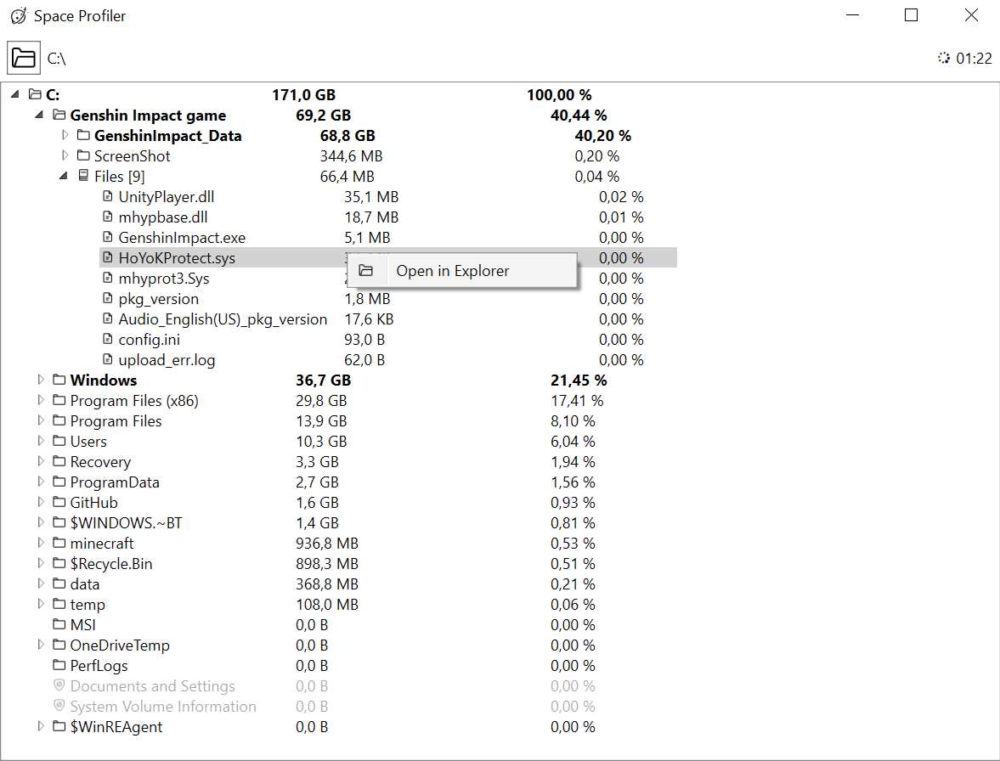
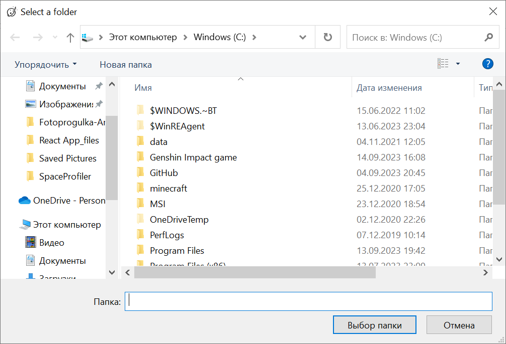
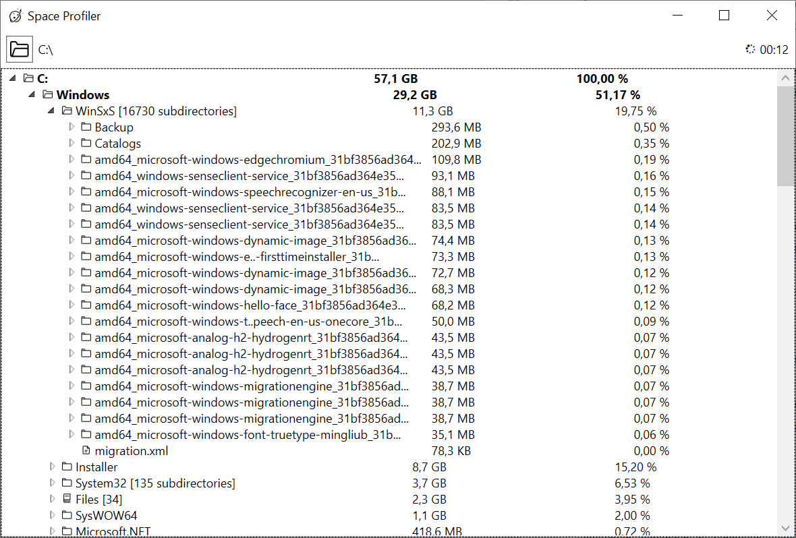
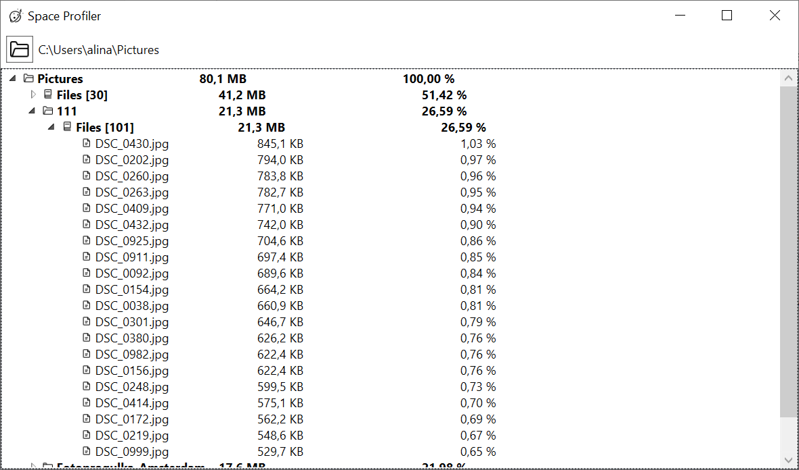

# SpaceProfiler

## UI
Дерево отображается сразу же после выбора текущего каталога.
Все рассчёты производятся асинхронно, дерево обновляется в режиме реального времени, а интерфейс остаётся отзывчивым. 
Узлы загружаются лениво, при открытии родителя. При закрытии родителя все дочерние узлы удаляются.

### Выбор каталога

Для выбора текущего каталога используется пакет [Ookii.Dialogs.Wpf](https://github.com/ookii-dialogs/ookii-dialogs-wpf). 
В WPF такой контрол пока [есть только в Preview](https://devblogs.microsoft.com/dotnet/announcing-dotnet-8-preview-7/)

### Отображение элементов
Для каждого элемента выводится его фактический размер и процент от размера корневого каталога.

В случае, если процент от корневого каталога превышает 20%, элемент выделяется жирным, так как является возможным кандидатом для удаления.

#### Группировка файлов
В случае, если каталог содержит больше одного файла и вложенные каталоги, происходит группировка файлов в отдельный узел Files [N],
где N - количество файлов в каталоге. Это позволяет предоставить пользователю более детальную информацию об интересующем его каталоге.

#### Отображение недоступных элементов

Если в ходе обработки дерева встречаются элементы, к которым нет доступа, или симлинки, то они отображаются серым, с особой иконкой
и имеют размер равный 0.

#### Иконки

У каждого элемента дерева есть своя иконка. Они разные для открытой и закрытой папки, пустого и непустого файла, группы файлов и
недоступного элемента. 
При изменении состояния элемента иконка так же меняется. 

#### Сортировка элементов
Сортировка элементов по убыванию размера реализована на уровне отображения элементов дерева при помощи TreeViewItemSortingConverter и происходит в режиме реального времени. 

### Реакция на изменения в файловой системе
Приложение реагирует на изменения в файловой системе:
- добавление файлов и каталогов
- удаление файлов и каталогов
- изменение файлов
- перемещение каталогов и файлов
- изменение прав доступа к файлам и каталогам

Отслеживание изменений запускается одновременно с первичной загрузкой дерева, что позволяет отображать максимально
актуальную информацию.

### Отображение прогресса загрузки
В случае, если загрузка дерева с диска занимает больше 1 секунды, в правом верхнем углу окна появляется лоадер и таймер.
После завершения загрузки лоадер изчезает, а время продолжает отображаться.

Такое решение позволяет избежать ненужного "моргания" лоадера в случае быстрой загрузки.

Синхронизация изменений файловой системы никак не отображается.

### Переход в Explorer
В контекстном меню элементов списка есть возможность перейти в Explorer.
Для файла/группы файлов откроется каталог, содержащий файл. При клике на каталог - откроется он сам.

Функция недоступна, если к папке нет доступа или она не существует на диске.

### Удаление корня
Если во время работы приложения удалить корневой каталог, то в отображении останется узел размера 0.

Если отменить удаление каталога, то изменения подтянутся и в интерфейс.

### Обработка папок с большим количеством элементов
Если в каталоге очень много элементов, то это будет приводить к зависанию интерфейса и негативному пользовательскому опыту.
Но в целевом сценарии пользователя и не интересуют все элементы - он хочет найти самые крупные и получить общее представление о содержимом папки.

Для директорий с большим количеством папок (>100) рядом с названием выводится количество подкаталогов. При попытке развернуть такой узел в интерфейсе 
отобразиться только 20 самых крупных подкаталогов.

Для директорий с большим количеством файлов (>100) будет добавлен узел "Files [N]". При попытке развернуть такой узел в интерфейсе
отобразиться только 20 самых крупных файлов.

# Внутреннее устройство приложения
## SpaceProfiler
Для обновления дерева в NodesUpdater создаётся фоновый поток. Раз в 500мс он получает изменения из модели и анализирует, что в отображении нужно обновить.
На UI треде выполняется только непосредственное изменение узлов.

Все ошибки при обработке изменений игнорируются. В худшем случае пользователь получит не очень актуальное отображение, но даже оно уже может дать ему ответ на интересующий вопрос. А ещё оно может "починиться" при следующем обновлении.
## SpaceProfilerLogic
### FileSystemEntryTree
Модель дерева в памяти. Поддерживает многопоточное изменение. Умеет по пути на диске актуализировать его состояние в дереве. Возвращает список изменённых узлов.
### SelfSustainableTree
Объединяет в себе логику получения информации для обновления дерева. Работа выстроена через взаимодействие разных потоков по принципу producer-consumer.

LoadFromDisk и WatchChanges получают список путей, которые нужно актуализировать в дереве, и передают их через очереди в ApplyChanges и ApplyRenewChanges, где и происходит само добавление в дерево.

Реализован механизм ретрая (1 раз) для обработки изменений в ходе первичной загрузки дерева.

Список изменённых узлов по запросу выдаётся UI.

Степень параллелизации можно менять только на уровне количества ApplyChanges и ApplyRenewChanges. Текущее количество я определила на основе времени обработки своего диска C (см. [пункт 10 в разделе Что можно улучшить](#improvement10)).
### DirectoryWatcher
Отслеживание изменений в директории при помощи [FileSystemWatcher](https://learn.microsoft.com/en-us/dotnet/api/system.io.filesystemwatcher?view=net-7.0).

### Тесты
В проекте SpaceProfilerLogicTests есть тесты на построение и актуализацию дерева, мониторинг изменений в файловой системе
# Что можно улучшить
<ol>
    <li id="improvement1">Сделать отображение дерева ещё красивее: выровнять столбцы между уровнями дерева, добавить названия колонок</li>
    <li id="improvement2">Отображать не только фактический размер файла, но и размер файла на диске с использованием <a href="https://learn.microsoft.com/en-us/windows/win32/api/fileapi/nf-fileapi-getcompressedfilesizew">fileapi.h</a></li>
    <li id="improvement3">Добавить логирование</li>
    <li id="improvement4">Обрабатывать Rename не как Create + Delete, а отдельно, не перестраивая поддерево заново</li>
    <li id="improvement5">Можно подумать в сторону исключения определённых системных папок из анализа полностью или частично. Например, в Windows есть каталог WinSxS, который часто меняется, содержит много подкаталогов, но при этом вряд ли станет кандидатом на удаления для очистки диска</li>
    <li id="improvement6">Развивая пункт 5, можно сделать более сложную и "умную" систему предложения пользователя вариантов для удаления и сделать отображение более гибким</li>
    <li id="improvement7">Добавить удаление в контекстное меню элемента</li>
    <li id="improvement8">Отображать прогресс загрузки, возможно для каждого элемента</li>
    <li id="improvement9">Сделать бенчмарки на загрузку дерева с диска</li>
    <li id="improvement10">Распараллелить загрузку дерева с диска и научиться динамически понимать, сколько потоков лучше брать</li>
</ol>